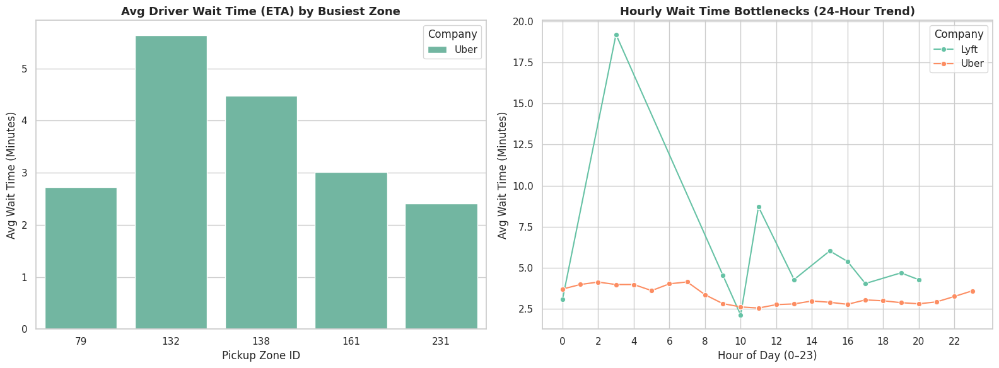
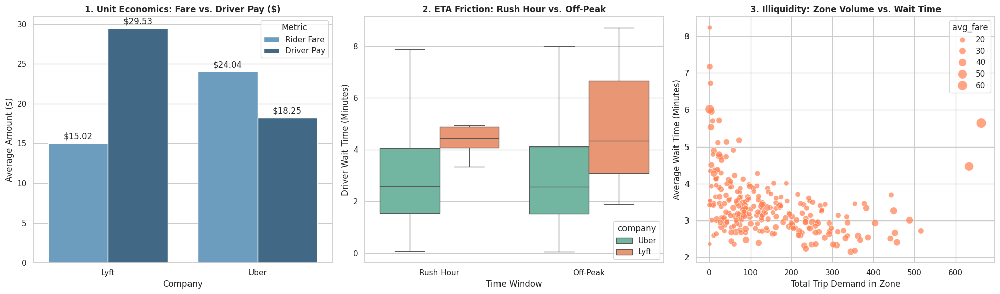

# 🚗 Rideshare Marketplace Supply-Demand Liquidity Engine

## Executive Summary
This portfolio project analyzes **50,000+ real-world Uber and Lyft trip records** from the NYC Taxi & Limousine Commission (TLC) dataset. By combining data engineering, statistical analysis, and product strategy, this project identifies spatial supply bottlenecks and proposes an automated **Dynamic Supply Liquidity Incentive System** to optimize driver availability and reduce rider ETAs.

---

## 🛠️ Tech Stack & Tools
* **Data Processing:** Python (`pandas`, `pyarrow`, `parquet`)
* **Visualization:** `seaborn`, `matplotlib`
* **Analytics Environment:** Google Colab / Jupyter Notebook
* **Dataset:** NYC TLC High-Volume For-Hire Vehicle Data (Real Uber/Lyft Trip Logs)

---

## 📊 Data Analysis & Visual Insights

### 1. Baseline Bottlenecks & Hourly Trends
* **ETA Variance:** Rider wait times peak heavily in specific high-density pickup zones.
* **Rush Hour Pressure:** Wait times spike consistently during morning and evening commute windows, signaling physical driver shortages.

---

### 2. Advanced Unit Economics & Reliability
* **Unit Economics:** Passenger fare vs. driver pay comparison proves that platform take-rates leave sufficient margin to fund localized rebalance bonuses.
* **Rush Hour Distribution:** Boxplot analysis demonstrates a much wider variance in wait times during peak hours, causing unpredictable user friction.
* **Volume Correlation:** Scatter plot analysis confirms a strong positive correlation between high trip demand and driver ETAs.

---

## 📄 Product Requirement Document (PRD)

### Title: Dynamic Supply Liquidity Incentive System

#### 1. Problem Statement
Localized driver shortages in high-density corridors cause rider wait times to spike above 8 minutes. This physical driver deficit leads to user drop-offs, lower conversion rates, and reduced platform liquidity.

#### 2. Core Target Metrics
* **North Star Metric:** Increase overall zone Match Rate from **72% to 85%**.
* **Guardrail Metrics:**
  * **Incentive Spend Cap:** Keep rebalance bonus costs under **$2.50 per fulfilled ride**.
  * **Driver Cancellation Rate:** Maintain driver cancellations below **4%**.
  * **Average Rider ETA:** Maintain average pickup wait times under **6 minutes**.

#### 3. Solution Specification: Dynamic Driver Rebalance Incentive
When unfulfilled searches in a zone exceed **20% over a 10-minute window**, the dispatch engine triggers an in-app **Relocation Bonus** to nearby idle drivers.

$$\text{Bonus Amount} = \text{Base Bonus } (\$2.00) + (\text{Unfulfilled Rate } \times \$5.00)$$

* **Driver In-App Alert:** *"High demand in Downtown! Complete 1 ride in Downtown over the next 30 minutes to earn a +$3.50 guaranteed bonus."*

#### 4. Edge Cases & Risk Mitigation

| Edge Case Scenario | Risk Level | Mitigation Logic |
| :--- | :--- | :--- |
| **Driver Gaming** | High | Require drivers to be online for at least 15 minutes prior to qualifying for localized rebalance bonuses. |
| **Phantom Demand** | Medium | Aggregate trigger metrics strictly using *unique authenticated user accounts* per 10-minute window. |
| **Severe Traffic / Gridlock** | High | Dynamically extend the bonus expiration timer by 15 minutes if average route speeds drop below 10 mph. |

---

## 🚀 How to Run the Code
1. Download or view the `.ipynb` notebook file in this repository.
2. Open it directly in [Google Colab](https://colab.research.google.com).
3. Run all cells sequentially to fetch the NYC TLC Parquet file and reproduce the visual charts.
